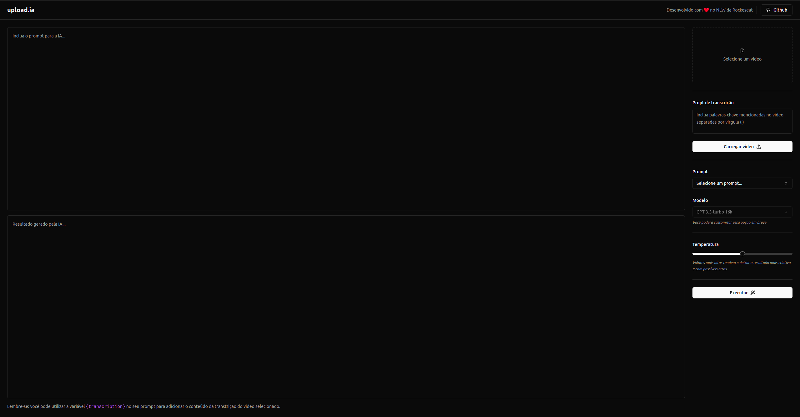

# upload-ia-web

### 🇺🇸 Project developed during rocketSeat's NLW Event to train integration with openAI with some modifications 

#### The project consists of an application where the user uploads a video and defines whether to generate suggestions for the title or description of the video, it also defines points such as temperature and key words 

___
### 🇧🇷 Projeto desenvolvido durante o Event NLW da rocketSeact para treinar integração com a openAI com algumas modificações 

#### O projeto consiste em uma aplicação que o usuário faz o upload de um video e define se quer gerar sugestoes de título ou a descrição do video, também define pontos como a temperatura e palavras chaves 

